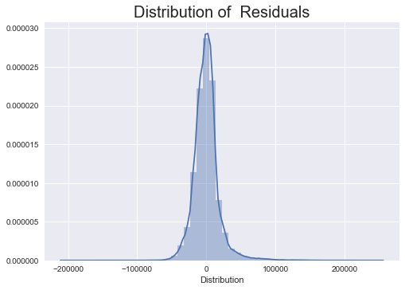
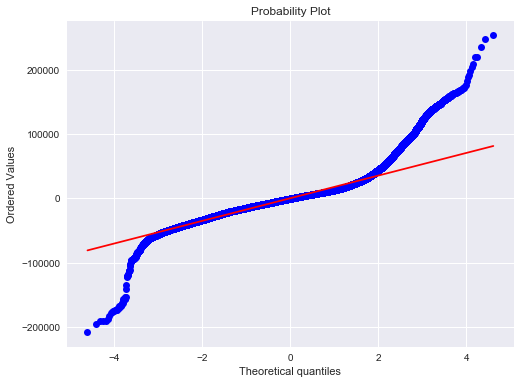

# Mod_2_Regression_Project

DSC NYC Flatiron Module 2 Project:
By: **Jason Drummond**

## Goal

To create a linear regression model that will be used to predict Salaries of NYC Employees based upon a multitude of different variables.

## Use Case

As a new high school graduate you would like to find a career that will pay the most upon graduating college.

## DataSet

Our Dataset comes from the NYC Open Data website, (https://data.cityofnewyork.us/City-Government/Citywide-Payroll-Data-Fiscal-Year-/k397-673e)

There were over 3 million rows in our Dataset depicting the salaries for NYC Employees between the years of 2014-2019. It is our goal to see what factors contribute most to an Employees Salary.

## Data Cleaning

There were many things that needed to be cleaned up in our Dataset. First we dropped Fiscal Year 2014 from our dataset as it had very little data to use. We then created a new column to explore any relationhip between number of years worked for city and Salary. Upon investigating the Data for Teachers I found bi problem that needed to be fixed. Whenever a Teacher does extracurricular work they get paid per session and this shows up in an entirely different row from their yearly salary. I took all the money they made from this row and addded it in as OT in their respective yearly salary row. This one step got rid of a big chink of Data as teachers are one of the most common jobs in NYC. From here I fixed all of the Agency Names to reflect the overarching Agency that they belong to, as some were broken down into smaller components, mainly Community Board, Department of Eduaction, and District Attorney. The last step was getting rid of anyone that was not a full time workker as we only wanted to focus on this group.

## Statistical Tests

* Two Sample T-test on two most populous jobs based on salary
  * We Rejected the null hypothesis that these salaries were not statisticaly different from one another
* Annova/MultiComparison Test on work location 
  * We Rejected the null hypothesis that the salaries in each borough were not statistically different
* Annova/MultiComparison Test on Pay Basis
  * We Rejected the null hypothesis that the salaries in each pay Basis were not Statistically different

## Feature Engineering

This was the biggest limitation to this DataSet. We could not create too many features as a majority of the Data was categorical. We were able to create a feature pertaining to how many years the person worked for the City. Other than that we mainly had to work with Dummy variables, we createdd them for all of the different agencies. Upon looking at all the different jobs in the Title Description column we had to limit dummy variables as it the amount would overload the OLS model and not give us a model. To make a good model based on this data we created dummy variable for all of the Title Descriptions and then looped through all of them and found the Jobs that gave us the highest R_squared value when compared to Salary and added them in to our model. This greatly boosted the R_squared of our model.

## Linear Models

We did three different Regression Models, a Linear, a Lasso, and a Ridge. Once we tested each model for its corresponding RMSE we found that the Linear Regression gave us the best RMSE. In a weird occurence we did test the log of our target variable against our features and it produced a worse RMSE compared to the original Linear Regresssion however the R_Squared value was better. We did not know how to explain this occurence but decided to use the Linear Regression without taking the log of our target variable.

## Conclusion
 

We were able to create a model that predicted the test data within 0.642 Standard Deviations. The MSE And RMSE of the Training and Test Data were very similar leading us to believe that the model was fairly good even if it was not the most accurate.

## Use Case Insights

* There has been a rise in Average Salary every year in the dataset 
* If you wanted to Retire Early the best Agencies to go into are as follows
  * Police Department
  * Department of Education
  * Fire Department
* If you want to be in the Top earning Agencies focus on jobs in the folloowing Agencies
  * Office Of Colletive Bargaining
  * Financial Info Svcs Agency
  * Office of the Actuary
